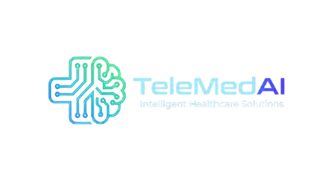

# 🏥 TeleMedAI - AI-Powered Smart Telemedicine Platform

<div align="center">



**Transform Healthcare with Intelligent Telemedicine**

[](https://opensource.org/licenses/MIT)
[](https://reactjs.org/)
[](https://www.typescriptlang.org/)
[](https://nodejs.org/)
[](https://www.python.org/)

[Features](#-features) • [Tech Stack](#-tech-stack) • [Getting Started](#-getting-started) • [Project Structure](#-project-structure) • [Documentation](#-documentation) • [Contributing](#-contributing)

</div>

---

## 📋 Overview

**TeleMedAI** is a comprehensive telemedicine platform that leverages artificial intelligence to revolutionize healthcare delivery. The platform provides intelligent symptom intake, real-time consultation assistance, and comprehensive post-care management for both patients and healthcare providers.

### 🎯 Key Objectives

- **Accessible Healthcare**: Connect patients with doctors anytime, anywhere
- **AI-Powered Assistance**: Intelligent symptom analysis and diagnostic support
- **Streamlined Workflows**: Efficient consultation and patient management
- **Data Security**: HIPAA-compliant, secure healthcare data handling
- **Better Outcomes**: Improved patient care through technology

---

## ✨ Features

### 👥 For Patients

- 🔍 **AI Symptom Checker** - Preliminary assessment powered by machine learning
- 📅 **Easy Appointment Booking** - Schedule consultations with specialists
- 💬 **Video Consultations** - Secure real-time video calls with doctors
- 📊 **Health Records** - Access and manage medical history
- 🔔 **Medication Reminders** - Automated alerts for prescriptions
- 📱 **Mobile-Friendly** - Responsive design for all devices

### 👨‍⚕️ For Doctors

- 🧠 **AI Diagnostic Support** - Intelligent suggestions during consultations
- 📋 **Patient Management** - Comprehensive patient profiles and history
- 💊 **Smart Prescriptions** - AI-assisted medication recommendations
- 📈 **Practice Analytics** - Insights and performance metrics
- 📝 **Clinical Notes** - AI-powered note-taking and summarization
- 🔒 **Secure Platform** - HIPAA-compliant data protection

---

## 🛠️ Tech Stack

### Frontend
- **Framework**: React 18+ with TypeScript
- **Build Tool**: Vite
- **Styling**: Tailwind CSS
- **UI Components**: shadcn/ui
- **Animations**: Framer Motion
- **State Management**: React Query (TanStack Query)
- **Routing**: React Router v6
- **Icons**: Lucide React

### Backend
- **Runtime**: Node.js 18+
- **Framework**: Express.js
- **API Style**: RESTful API
- **Authentication**: JWT (planned)
- **Database**: PostgreSQL (planned)
- **File Storage**: AWS S3 (planned)

### AI/ML
- **Language**: Python 3.11+
- **ML Frameworks**: TensorFlow, PyTorch
- **NLP**: Hugging Face Transformers
- **Data Processing**: Pandas, NumPy
- **ML Operations**: Scikit-learn

### DevOps
- **Version Control**: Git & GitHub
- **CI/CD**: GitHub Actions (planned)
- **Containerization**: Docker (planned)
- **Cloud**: AWS/Azure (planned)

---

## 🚀 Getting Started

### Prerequisites

- **Node.js** 18.0 or higher
- **Python** 3.11 or higher
- **npm** or **yarn** or **bun**
- **pip** for Python packages
- **Git** for version control

### Installation

1. **Clone the repository**
   ```bash
   git clone https://github.com/yourusername/TeleMedAI-Project.git
   cd TeleMedAI-Project
   ```

2. **Setup Frontend**
   ```bash
   cd frontend
   npm install
   npm run dev
   ```
   Frontend will run on `http://localhost:5173`

3. **Setup Backend**
   ```bash
   cd backend
   npm install
   npm start
   ```
   Backend will run on `http://localhost:5000`

4. **Setup AI-ML Module**
   ```bash
   cd AI-ML
   
   # Create virtual environment (recommended)
   python -m venv venv
   source venv/bin/activate  # On Windows: venv\Scripts\activate
   
   # Install dependencies
   pip install -r requirements.txt
   
   # Run hello world
   python hello.py
   ```

---

## 📁 Project Structure

```
TeleMedAI-Project/
│
├── frontend/                   # React + TypeScript Frontend
│   ├── public/                # Static assets
│   │   ├── logo.png
│   │   ├── favicon.png
│   │   └── robots.txt
│   ├── src/
│   │   ├── components/        # React components
│   │   │   ├── common/       # Reusable components
│   │   │   ├── landing/      # Landing page sections
│   │   │   ├── ui/           # shadcn/ui components
│   │   │   └── Navbar.tsx    # Main navigation
│   │   ├── pages/            # Page components
│   │   │   ├── auth/         # Authentication pages
│   │   │   ├── Landing.tsx
│   │   │   ├── PatientDashboard.tsx
│   │   │   └── DoctorDashboard.tsx
│   │   ├── constants/        # Constants & config
│   │   ├── hooks/            # Custom React hooks
│   │   ├── lib/              # Utility functions
│   │   ├── types/            # TypeScript types
│   │   ├── App.tsx           # Main app component
│   │   └── main.tsx          # Entry point
│   ├── package.json
│   ├── vite.config.ts
│   ├── tailwind.config.ts
│   └── AUTH_README.md        # Auth system docs
│
├── backend/                   # Node.js + Express Backend
│   ├── server.js             # Main server file
│   ├── package.json          # Dependencies
│   ├── .env                  # Environment variables
│   └── README.md             # Backend documentation
│
├── AI-ML/                     # Python AI/ML Module
│   ├── hello.py              # Hello world program
│   ├── requirements.txt      # Python dependencies
│   └── README.md             # AI-ML documentation
│
├── .gitignore                # Git ignore rules
└── README.md                 # This file
```

---

## 🎨 Key Features Implementation

### 1. Authentication System

Complete authentication flow for both patients and doctors:

- ✅ Patient Login & Signup
- ✅ Doctor Login & Signup
- ✅ Form validation
- ✅ Role-based routing
- ✅ Professional verification notice for doctors

**Routes:**
- `/patient-login` - Patient authentication
- `/patient-signup` - Patient registration
- `/doctor-login` - Doctor authentication
- `/doctor-signup` - Doctor registration (with license verification)

### 2. Responsive Navbar

Professional navigation with smooth animations:

- ✅ Logo and branding
- ✅ Smooth scroll navigation
- ✅ Login/Signup dropdowns with role selection
- ✅ Mobile hamburger menu
- ✅ Accessible keyboard navigation

### 3. Landing Page

Modern hero section with:

- ✅ Animated gradients and backgrounds
- ✅ Trust indicators (HIPAA, Security badges)
- ✅ Feature highlights
- ✅ Call-to-action buttons
- ✅ Floating stat cards

### 4. Dashboard Placeholders

- ✅ Patient Dashboard - Health management interface
- ✅ Doctor Dashboard - Practice management interface

---

## 📚 Documentation

### Individual Module Documentation

- **Frontend**: See [frontend/README.md](frontend/README.md)
- **Authentication**: See [frontend/AUTH_README.md](frontend/AUTH_README.md)
- **Backend**: See [backend/README.md](backend/README.md)
- **AI-ML**: See [AI-ML/README.md](AI-ML/README.md)

### API Documentation

#### Backend API Endpoints

```
GET  /              - Hello World / Server info
GET  /health        - Health check endpoint
GET  /api           - API information
```

### Frontend Routes

```
/                      - Landing page
/patient-login         - Patient authentication
/patient-signup        - Patient registration
/patient-dashboard     - Patient portal
/doctor-login          - Doctor authentication
/doctor-signup         - Doctor registration
/doctor-dashboard      - Doctor portal
```

---

## 🔐 Security & Compliance

### Current Implementation

- ✅ Environment variables for sensitive data
- ✅ CORS configuration
- ✅ Input validation on forms
- ✅ Password requirements (min 8 characters)

### Planned Features

- 🔲 JWT authentication
- 🔲 HIPAA-compliant data encryption
- 🔲 Two-factor authentication (2FA)
- 🔲 Role-based access control (RBAC)
- 🔲 Audit logging
- 🔲 Medical license verification
- 🔲 Data anonymization

---

## 🧪 Testing

### Frontend
```bash
cd frontend
npm run test        # Run tests
npm run test:ui     # Run tests with UI
npm run coverage    # Generate coverage report
```

### Backend
```bash
cd backend
npm test            # Run tests
npm run test:watch  # Watch mode
```

### AI-ML
```bash
cd AI-ML
pytest              # Run tests
pytest --cov        # With coverage
```

---

## 🚧 Development Roadmap

### Phase 1: Foundation (Current)
- ✅ Project setup and structure
- ✅ Frontend UI components
- ✅ Authentication system
- ✅ Basic backend API
- ✅ AI-ML module initialization

### Phase 2: Core Features (Next)
- 🔲 User authentication backend
- 🔲 Database integration
- 🔲 Video consultation system
- 🔲 Real-time chat
- 🔲 Appointment scheduling

### Phase 3: AI Integration
- 🔲 Symptom analysis AI model
- 🔲 Diagnostic prediction
- 🔲 Medication recommendation system
- 🔲 Clinical note summarization
- 🔲 Health trend analysis

### Phase 4: Advanced Features
- 🔲 Electronic health records (EHR)
- 🔲 Payment integration
- 🔲 Prescription management
- 🔲 Lab results integration
- 🔲 Mobile apps (iOS/Android)

### Phase 5: Scale & Deploy
- 🔲 Performance optimization
- 🔲 Load balancing
- 🔲 Cloud deployment
- 🔲 Monitoring & analytics
- 🔲 Production release

---

## 🤝 Contributing

We welcome contributions! Please follow these steps:

1. **Fork the repository**
2. **Create a feature branch**
   ```bash
   git checkout -b feature/AmazingFeature
   ```
3. **Commit your changes**
   ```bash
   git commit -m 'Add some AmazingFeature'
   ```
4. **Push to the branch**
   ```bash
   git push origin feature/AmazingFeature
   ```
5. **Open a Pull Request**

### Code Style Guidelines

- **Frontend**: Follow ESLint & Prettier configuration
- **Backend**: Use ESLint with Node.js best practices
- **Python**: Follow PEP 8 style guide
- **TypeScript**: Strict mode enabled, no `any` types
- **Commits**: Use conventional commit messages

---

## 📝 License

This project is licensed under the MIT License - see the [LICENSE](LICENSE) file for details.

---

## 👥 Team

- **Frontend Development**: React + TypeScript
- **Backend Development**: Node.js + Express
- **AI/ML Development**: Python + TensorFlow/PyTorch
- **UI/UX Design**: Figma + Tailwind CSS

---

## 📞 Support

For support, email support@telemedai.com or join our Slack channel.

---

## 🙏 Acknowledgments

- **shadcn/ui** - Beautiful UI components
- **Lucide** - Clean, consistent icons
- **Framer Motion** - Smooth animations
- **Hugging Face** - NLP models
- **OpenAI** - AI inspiration

---

## 📊 Project Status


---

<div align="center">

**Built with ❤️ for Better Healthcare**

[Website](https://telemedai.com) • [Documentation](https://docs.telemedai.com) • [Blog](https://blog.telemedai.com)

</div>
